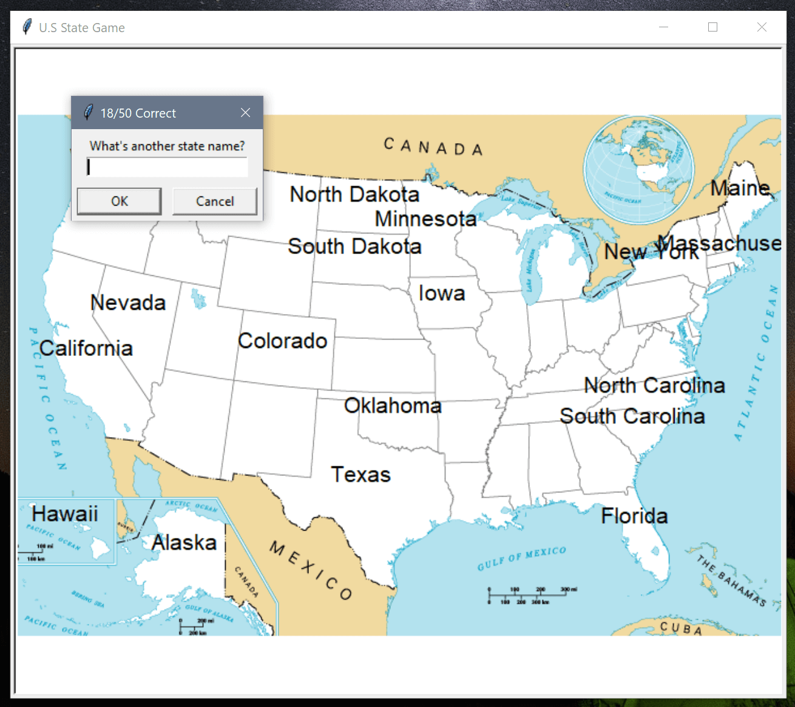

# State Game

Can you guess all the states in the US? Give it a shot! The game was built with the Pandas and Turtle module. 



## How to play

First clone the repository and install the pandas and turtle module. Then run the following command:

```
python main.py
```

You may enter the state name into the box and it will auto append in the map if you got it right. Type "Exit" if you wish to finish the game.

The game will write all the states that you couldn't guess to the states_to_learn.csv file.

## Show your support

Give a ⭐️ if you like this project!

## License

[MIT](LICENSE)